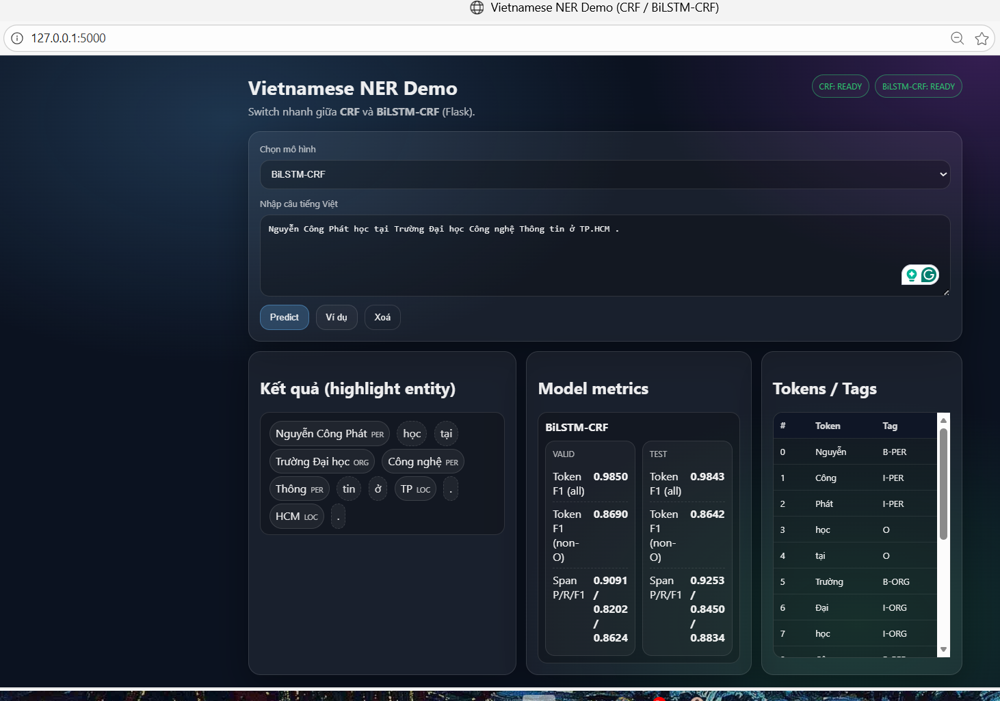

<p align="center">
  <a href="https://www.uit.edu.vn/" title="University of Information Technology" style="border: none;">
    
  </a>
</p>

<h1 align="center"><b>CS221.Q12 - Natural Language Processing</b></h1>

# CS221 Course Project: Vietnamese Named Entity Recognition (NER)

> This repository contains the full implementation of a **Vietnamese Named Entity Recognition (NER)** system developed for the course **CS221.Q12 – Natural Language Processing** at the University of Information Technology (UIT – VNU-HCM).  
>  
> The project focuses on **sequence labeling** for Vietnamese text using three classical and neural approaches: **Hidden Markov Model (HMM)**, **Conditional Random Fields (CRF)**, and **BiLSTM-CRF**.  
>  
> In addition to model training and evaluation, we also provide a **Flask-based interactive demo** that allows users to switch between CRF and BiLSTM-CRF models and visualize prediction results.
<p align="center">
  
</p>

---

## Team Information
| No. | Student ID | Full Name | Role | Github | Email |
|----:|:----------:|-----------|------|--------|-------|
| 1 | 23521143 | Nguyen Cong Phat | Leader | [paht2005](https://github.com/paht2005) | 23521143@gm.uit.edu.vn |
| 2 | 23521168 | Nguyen Le Phong | Member | [kllp031](https://github.com/kllp031) | 23521168@gm.uit.edu.vn  |
| 3 | 23520384 | Pham Tran Khanh Duy | Member | [PhDuy2005](https://github.com/PhDuy2005/) |  23520384@gm.uit.edu.vn  | 


---

## Table of Contents
- [Features](#features)
- [Dataset](#dataset)
- [Repository Structure](#repository-structure)
- [Methodology](#methodology)
- [Installation](#installation)
- [Usage](#usage)
- [Results](#results)
- [Demo](#demo)
- [Conclusion](#conclusion)
- [License](#license)

---

## Features
- Implementation of **three NER models**:
  - Hidden Markov Model (HMM)
  - Conditional Random Fields (CRF)
  - BiLSTM-CRF (PyTorch)
- Full training pipeline using **Jupyter notebooks**.
- Evaluation using **token-level and span-level metrics**.
- Saved best models for inference (`.joblib`, `.pt`).
- **Flask web demo**:
  - Switch between CRF and BiLSTM-CRF.
  - Highlight predicted named entities.
  - Display model metrics (F1, Precision, Recall).
- Clean project structure suitable for academic submission.

---

## Dataset
- Dataset: **VLSP 2016 Vietnamese NER**
- Format: CoNLL-style text files.
- Data splits:
  - `train.txt`
  - `test.txt`
- Entity types include:
  - `PER` (Person entities)
  - `ORG` (Organization entities)
  - `LOC` (Location entities)
  - `MISC` (Miscellaneous entities)
  - `O` (Outside tag for non-entity tokens)

---

## Repository Structure
```
CS221.Q12-Vietnamese-Named-Entity-Recognition/
│
├── dataset/
│   ├── train.txt                  # Training data (VLSP 2016 format)
│   └── test.txt                   # Test data (VLSP 2016 format)
│
├── figs/
│   ├── *.jpg                      # Figures used in report and slides
│   └── *.png                      # Figures used in report and slides
│
├── models/
│   ├── crf_best.joblib            # Best CRF model (sklearn-crfsuite)
│   └── bilstm_crf_best.pt         # Best BiLSTM-CRF model (PyTorch)
│
├── outputs/
│   ├── CRF_test_report.txt        # CRF evaluation results on test set
│   ├── CRF_valid_report.txt       # CRF evaluation results on validation set
│   ├── bilstm_valid_report_best.txt# Best BiLSTM-CRF validation report
│   ├── bilstm_test_report.txt     # BiLSTM-CRF evaluation results on test set
│   └── demo.png                   # Screenshot of Flask demo interface
│
├── src/
│   ├── train_HMM.ipynb            # Training notebook for HMM model
│   ├── train_CRF.ipynb            # Training notebook for CRF model
│   └── train_BiLSTM-CRF.ipynb     # Training notebook for BiLSTM-CRF model
│
├── static/
│   ├── style.css                  # CSS styles for Flask web demo
│   └── script.js                  # JavaScript logic for UI interactions
│
├── templates/
│   └── index.html                 # Main HTML template for Flask app
│
├── app.py                         # Flask application entry point
├── requirements.txt               # Python dependencies
├── CS221_Slides.pdf               # Presentation slides
└── README.md                      # Project documentation
```

---
## Methodology

### 1. Hidden Markov Model (HMM)
- Classical probabilistic sequence labeling model.
- Trained using:
  - Emission probabilities
  - Transition probabilities
- Used as a **baseline** model.

### 2. Conditional Random Fields (CRF)
- Discriminative sequence labeling model.
- Feature-based approach:
  - Current word
  - Context window
  - Capitalization patterns
- Implemented using **sklearn-crfsuite**.

### 3. BiLSTM-CRF
- Neural sequence labeling architecture:
  - Word embeddings
  - Bidirectional LSTM
  - CRF decoding layer
- Implemented using **PyTorch + pytorch-crf**.
- Achieved the best overall performance.

---

## Installation

### 1. Clone repository
```bash
git clone https://github.com/paht2005/CS221.Q12-Vietnamese-Named-Entity-Recognition.git
cd CS221.Q12-Vietnamese-Named-Entity-Recognition
```
### 2. (Optional) Create virtual environment
```bash
python -m venv .venv
source .venv/bin/activate      # Linux / Mac
.venv\Scripts\activate         # Windows

```
### 3. Install dependencies
```bash
pip install -r requirements.txt
```

--- 

## Usage
### 1. Train models
Open and run notebooks in **src/**:
```bash
jupyter notebook
```
- train_HMM.ipynb
- train_CRF.ipynb
- train_BiLSTM-CRF.ipynb

### 2. Run Flask demo
```bash
python app.py
```
Open browser at:
```bash
http:*//127.0.0.1:5000*

```
